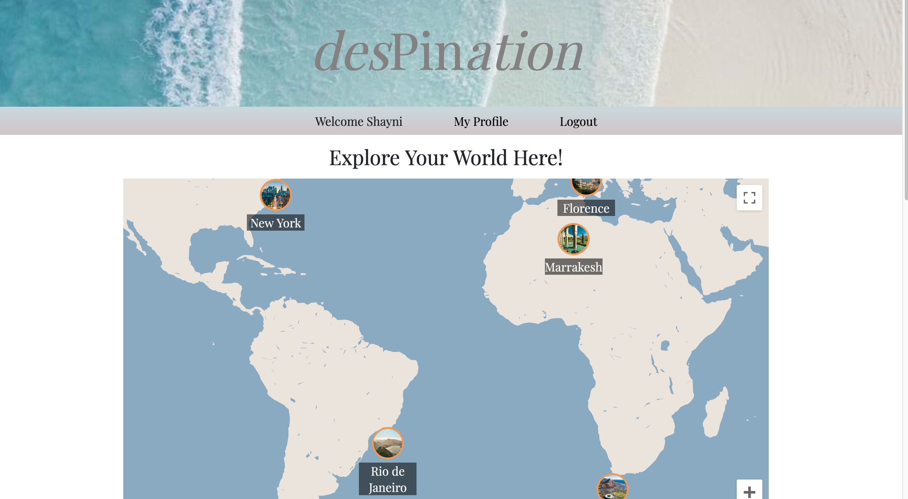
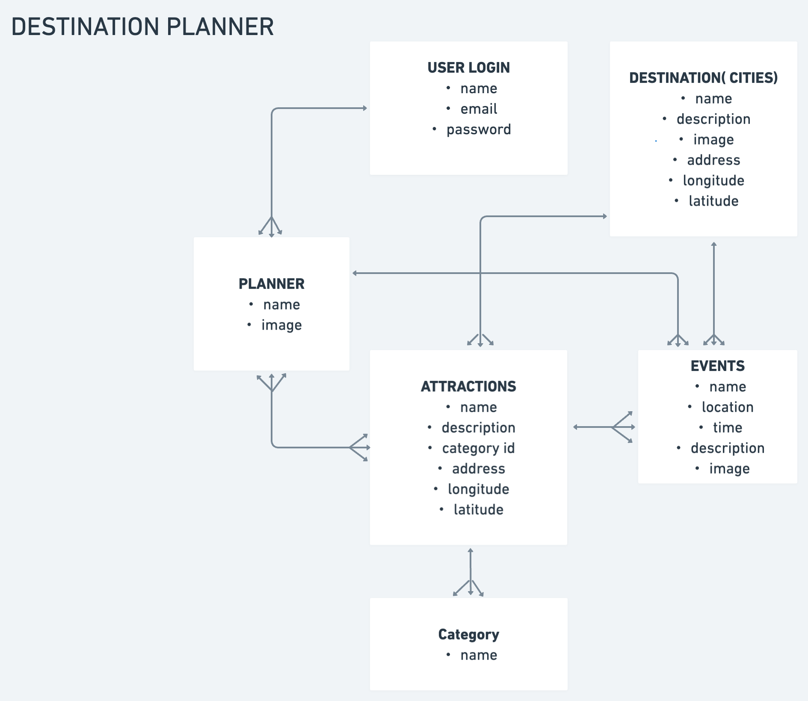

# Destination Planner

link to our webpage - [DesPination](https://despination.netlify.app/)
### Overview of webpage 




### DesPination

Our third project at General Assembly is a group project. After being taught React front-end frameworks for 2 days, our team decided to challenge ourselves to work with React and Ruby on Rails as both as our front-end and back-end frameworks. 

This destination planner app is the reflection of our passion for travelling. We have gathered some of the major cities that we would like to visit one day! Thank God for end of Covid restrictions ❤️  Enjoy browsing through our app!


### How to use the app
The homepage has a feature map that displays some of the major cities around the world. Just click onto the marker and it will directly bring you to the destination that you have selected. (Hint hint, you can click onto the title, 'Despination' anytime to get to the homepage).

In the destination page, there's a list of attractions with categories such as historical & culture, landscape & nature and eateries. The attractions' images in the destination page are clickable links to each of the attraction page. As you move further down the destination show page, you'll see a list of events in this particular city. At the bottom of the page, there's a map displaying the overall scale of the particular city with the attraction markers. 

This is not the end of the destination page! If you noticed, there is a prompt at the top of each page suggesting to users to either log in or sign up to access more features. Once you have logged in, you will find yourself in your own profile page where you can create your own planners. Users that have signed up to this website have the advantage to pin their favourite attractions and events into the planner that they have created. Furthermore, there is a note taking section at the bottom of the plannner, called 'My Notes', for users to put down to-do-list or maybe plan their future trip.  

Logged-in users can view the number of likes of a particular attraction in each of the attraction's page and provide their feedback on this attraction by clicking the like button (If they change their mind, they can click the like-button again to unlike). As mentioned before, logged-in users can add or remove their favourite attractions and events into the planner in each of the attraction page. 


### Login Details

```
email: luke@ga.co
password: chicken

email: kris@ga.co
password: chicken

email: shayni@ga.co
password: chicken

```


### Behind the Scenes


### Project Features
#### Object Model Associations 


#### Tools Used 

> * React
> * Ruby on Rails
> * Bootstrap SCC
> * CSS
> * HTML 
> * Heroku
> * Cloudinary

#### Gem Used 

> * Geocoder 
> * Rack-cors
> * Knock
> * jwt

#### Node Module Used 

> * Google-map-react


#### Wish List 
> * search bar
> * enforce strong password for sign up
> * calendar to show the events for trip planning


---
#### Issues
1. Just started learning React for 2 days before attempting this 😭

---

